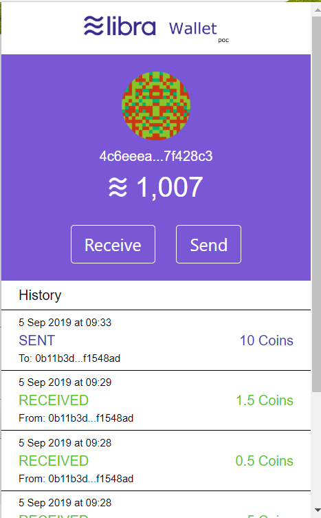

# Libra Chrome Extension POC
---
An Libra Wallet POC in Chrome Browser inspired by [MetaMask](https://metamask.io) and [Kulap Libra Wallet POC](https://dev.kulap.io/libra/)



## Live 
---
[Chrome Web Extension (based on release v.1.0.0)](https://chrome.google.com/webstore/detail/libra-wallet-poc-chrome-e/hgbfjdbadjhmkmkjfikijdjakeajbaol?utm_source=chrome-ntp-icon)


[Demo Page](https://libra-extension-demo.firebaseapp.com/)

## Feature
---
- creating wallet based on BIP39, receive and transfer libra like normal wallet 💰
- unlock wallet with password protected and store wallet in local storage with encryption 🔑
- send and receive libra notification 💌 
- integrate with web application with wallet API inspired by MetaMask 💻

## API
---

This extension will inject api via window.libra object.

### Get Account
```javascript
let account = await window.libra.getAccount()
```

### Get Balance
```javascript
let balance = await window.libra.getBalance()
```

### Get Transaction History
```javascript
let transactions = await window.libra.getTransactions()
```

### Transfer
```javascript
let result = await window.libra.transfer(address, amount)
// example
// let result = await window.libra.transfer('c4d04d41ea1453db808e2e3a559f49a39d78fcefd6b87ebd41a0440b6017ff79', 100.55)
```

### Request for Signature (v1.0.1)
```javascript
let signature = await window.libra.sign(text)
// example
// let signature = await window.libra.sign('hello world')
```

### Verify Signature (v1.0.1)
```javascript
await window.libra.verify(text, signature)
// this will throw reject promise if signature is invalid
// await window.libra.verify('hello world', '510161F5DEB68A0F36B6579D08B61FE38607F14699D59745329EB308A5476F54F3424E51A1F71F039CAD2C5DC988CE79F3F2D9BD15089FD764E92D720FB78500')
```

## Building chrome extension
---

- npm install
- npm run watch:dev
- go the extension and enable developer mode in chrome browser
- click on "Load unpacked" and select on "dist" folder


## License
---

Libra Wallet POC is released under the terms of the MIT license. See [LICENSE](LICENSE) for more
information or see https://opensource.org/licenses/MIT.